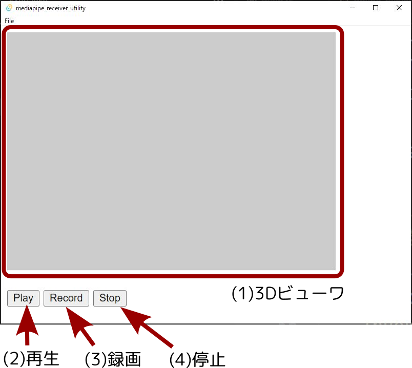

# mediapipe_receiver_utility

- Author: Hiroaki Yaguchi, 947D Tech.
- License: Apache 2.0 License

## 本プログラムについて

筆者による改造版Mediapipeを使った情報取得の
tauriによるサンプルプログラムです。
holistic trackingを用いることで、スマホ一台で全身トラッキングが可能です。

Android側のアプリケーションは
輪廻ヒロおよびHIROMEIROの
コントローラとして使用されているものと
同一のプログラムになります。

## Dependencies

rust, tauri, nodejsを最低限インストールしてください

- rust
- tauri
- tokio
- tokio-util
- nodejs
- webpack
- threejs

## 使用方法

### 改造版mediapipeの準備

改造版mediapipeの実行には、
ある程度の性能のAndroid端末
(最低動作確認環境はGoogle Pixel 5)
が必要です。

改造版mediapipeは以下のどちらかの方法で入手してください。

#### HIROMEIRO同梱のビルド済みapkを利用する方法

以下のリポジトリのリリースから
入手・インストールを行ってください。

https://github.com/947dTech/HIROMEIRO

#### 自前でビルドする方法

Mediapipe Android appをビルドできる環境(Dockerを推奨します)
を準備してください。

まず、改造版mediapipeのソースコードをgithubから取得してください。

https://github.com/947dTech/mediapipe

`holistic_v0.9.2.1_release`というブランチを使用します。

mediapipe環境の構築はDockerの利用を推奨します。

https://google.github.io/mediapipe/getting_started/install.html#installing-using-docker

Androidビルド環境の構築は公式ドキュメントを参照してください。

https://google.github.io/mediapipe/getting_started/android.html

Android appのビルドは以下のコマンドでできます。

```
$ bazelisk build -c opt --config=android_arm64 --linkopt="-s" mediapipe/examples/android/src/java/com/google/mediapipe/apps/holistictrackinggpu:holistictrackinggpu
```

インストールは実機をadbで認識させた上で、以下の方法でできます。

```
$ adb install bazel-bin/mediapipe/examples/android/src/java/com/google/mediapipe/apps/holistictrackinggpu/holistictrackinggpu.apk
```

起動すると、イニシャライズ(そこそこ時間がかかります)の後、画面に認識結果が表示されます。
設定されたIPアドレスのポート番号947D(10進数で38013)にUDPでデータを送信します。
設定はアプリ側のsettingsから変更可能です。
送信されてくるデータの仕様は基本的に元の仕様を参照してjsonにしたものです。

https://google.github.io/mediapipe/solutions/holistic.html

- `pose_world_landmarks`にm単位での姿勢認識結果が格納されます。
- `pose_landmarks`に姿勢認識結果が格納されます。
- `face_landmarks`に表情認識結果が格納されます。
- `right_hand_landmarks`,`left_hand_landmarks`に両手の認識結果がそれぞれ格納されます。

ただし、各ランドマークにタイムスタンプを追加しています。
利用方法は本プログラムを参照してください。

`pose_world_landmarks`以外の認識結果は
画面のアスペクト比を考慮する必要があることに注意してください。

デフォルトではインカメラを利用しています。
そのため、鏡像であることに注意してください。

また、スマホの向きを認識するための`gravity`を同時に送信しています。
カメラ向きの推定にご利用ください。

- `gravity`: 重力ベクトル
- `gravity_stamp`: 取得時刻

カメラパラメータを追加で送信しています。
これを用いることで、`pose_landmarks`と`pose_world_landmarks`を比較して
カメラ座標系における人物の三次元位置の推定が可能です。

- `camera_params`
    - `focal_length`: 焦点距離(単位はピクセル)
    - `frame_width`: 画像の幅
    - `frame_height`: 画像の高さ

### アプリケーション本体の起動

```
$ npx webpack
$ cargo tauri dev
```

起動すると、
online playerとoffline playerを選択する画面になります。
クリックでどちらかを選択してください。


### Online Player



オンラインモードでは改造版mediapipeのアプリから送信されてきた
データの表示、保存を行います。
あらかじめアプリを起動し、
送信先IPアドレスを
本アプリケーションを起動しているPCに設定してください。

(1) 3Dビューワには認識結果を3Dで表示します。
ドラッグで角度を変更することができます。

(2) Playボタンを押すとUDPで送られてきた
mediapipeの認識結果を表示します。

(3) Recordボタンを押すと
保存先のファイルを選択するダイアログが開きます。
ファイルを指定すると、
Playボタン同様に認識結果を表示し、
指定されたファイルに保存していきます。

(4) Stopボタンを押すと
Play/Record状態を停止します。
Play/Recordはどちらか一方のみが動作します。
切り替える場合は一度Stopを押してください。


### Offline Player


オフラインモードでは
オンラインモードで保存したデータを再生します。
まずメニューからFile->Openを選択してください。
保存されたファイルを選択するダイアログが開きます。
ファイルを選択して読み込んでください。

(1) 3Dビューワには認識結果を3Dで表示します。
ドラッグで角度を変更することができます。

ファイルを読み込んだ後、
(2) Playボタンを押すとデータを再生します。
再生中はローカルホストに向けてUDP送信を行います。
HIROMEIROを起動しておくと再生中のデータが反映されます。

再生中に(3) Pause / (4) Stopボタンを押すと停止します。
PauseとStopの違いは、
Pauseを押した場合その場で停止し、
次にPlayを押すと再開されます。
Stopを押した場合は先頭に戻り、
次にPlayを押すと先頭から再生されます。

停止した状態で
(5)シークバーを動かすと指定のフレームに移動できます。
(6) Prev / (7) Nextボタンを押すと
1フレームずつ移動することができます。
停止している状態ではUDP送信はおこなわれません。
